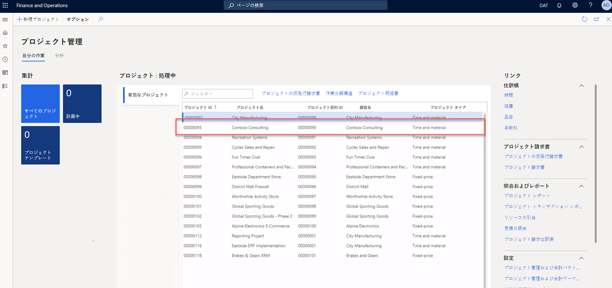
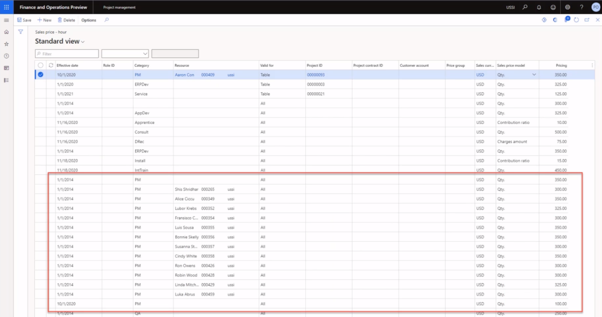

---
demo:
    title: 'デモ 1: Project Operations の価格設定'
    module: 'モジュール 5: Microsoft Dynamics 365 Project Operations の基礎を学ぶ'
---

## デモ 1 - Project Operations の価格設定

1. **「プロジェクト管理」** ワークスペースに移動します。  
    このデモではプロジェクト運営の範囲での売上高とコストの価格を設定します。さらに、発行済みの請求書を基にコストと価格がどのように算出されるかについて学習します。

1. 右上の会社情報欄で接続先法人が **USSI** であることを確認してください。  
    別の法人が表示されている場合は、**USSI** に変更してください。

1. **「進行中のプロジェクト」** テーブルでプロジェクト **「00000093 Contoso Consulting」** を選択します。プロジェクト詳細が表示されます。

    

1. **「Contoso Consulting」** ページのナビゲーション バーで **「管理」** タブを選択します。

1. **「管理」** メニューで **「請求書仕訳帳」** を選択します。  
    ここでは時間数を適用した請求書を指定してあります。

1. **「請求書トランザクション」** の下、 **「販売価格」** の列で **「350.00」** をポイントします。  
    このビューには USSI 担当プロジェクト マネージャー Aaron Con の販売価格が課金レート 350 ドルとして表示されています。このレートがどのように決まったかを把握するために価格設定を復習します。

      

    個々のプロジェクトから価格を確認できますが、すべての価格設定を把握するため、**「プロジェクト管理」** ワークスペースから始めることにします。

1. **「プロジェクト管理」** ワークスペースに移動します。

1. **「リンク」** セクションの画面右側、**「設定」** サブメニューで **「販売価格 (時間)」** を選択します。

1. **「販売価格 – 時間」** ページの表の **「価格設定」** 列で **350.00** をポイントします。  
このビューから Aaron Con の販売価格 350 ドルがどのように設定されたかわかります。

1. 最初の行全体をポイントします。  
    その行全体を見れば Aaron はプロジェクト マネージャーとして設定されていることがわかります。また、そのレートは Contoso Consulting の特定のプロジェクト ID に関連付けられていることがわかります。

1. **「リソース」** 列で、割当リソースがあるその他すべての行をポイントします。  
    このテーブルには他のプロジェクト マネージャーも設定されていることがわかりますが、これらのマネージャーには特定のプロジェクト ID が割り当てられていません。このため、これらのレートは割り当てられたカテゴリとリソースにのみ適用されます。

      

    このマトリックスは非常に柔軟性があるため、Contoso Consulting と Aaron Con で見られる詳細なレベルに対応できるだけでなく、この例で示したとおり、$300 というより一般化された価格設定モデルにも対応可能です。

1. Contoso プロジェクトについては **「請求書仕訳帳」** ページへ進んでください。  
    発行済みの請求書に戻り、同じ時間数のトランザクションを確認し、請求書のトランザクション行のトランザクション ID を選択すると、Aaron Con に関連するコストを確認できます。

1. **「請求書トランザクション」** セクションで **「時間」** タブを選択します。表示されるテーブルで、**「トランザクション ID」** 列からトランザクション ID を一つ選択します。

    

1. **「時間トランザクション」** ページで **「概要」** タブを選択します。表示されるテーブルの **「原価価格」** 列で、**「200.00」** をポイントします。  
    時間トランザクション ビューから、Aaron Con のエントリーで、関連する原価価格が $200 であることを確認できます。原価価格の設定を見直し、その原価率の算出方法を確認します。

1. **「プロジェクト管理」** ワークスペースに移動します。

1. 画面右側、**「設定」** サブメニューにある **「リンク」** セクションから **「原価価格 (時間)」**.を選択します。

1. **「原価価格 – 時間 標準ビュー」** ページのテーブルで **「有効日」** 列に **1/1/2014**、**「カテゴリ」** 列では **PM** 、**「原価価格」** 列では **200.00** であり、他の列に値がない行をポイントします。  
    このビューでPM カテゴリ専用に設定された原価価格が $200 であることがわかりますが、Aaron または Contoso コンサルティング プロジェクトに関連するその他の行がありません。これも多くのサービス業ではプロジェクトのロールとして識別されたカテゴリ全体に標準原価率を適用するため一般的によく行われます。この原価は混合レートの場合が多く、個々のリソースの支払率は、給与計算または人事システム内にのみ保存されます。標準原価率は、次に定期的に調整され、給与計算原価の分析をして、その数字が正確で、利益が達成されているかどうかの確認が行われます。

    

1. **「プロジェクト管理」** ワークスペースに移動します。

1. 画面右側、**「設定」** サブメニューにある **「リンク」** セクションから **「原価価格 (時間)」** と **「販売価格 (時間)」** をポイントします。  

このデモでは Project Operations で標準販売価格と原価価格の設定方法について掘り下げました。これが発行済み請求書に及ぼす影響を復習し、これらの価格の設定による表現された時間/実費払い請求書への直接的影響のし方について把握しました。
