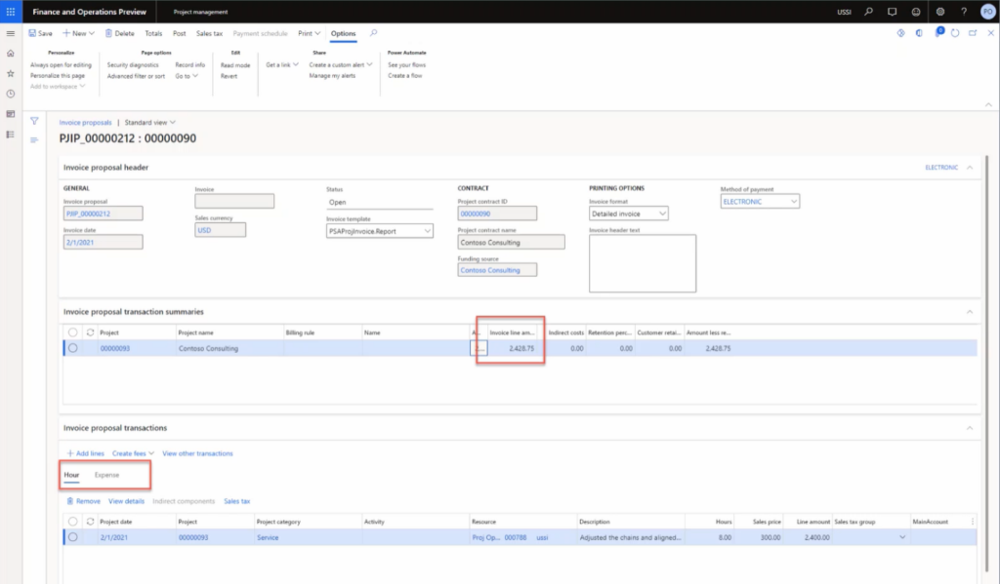

---
demo:
    title: 'デモ 2: 請求書の作成'
    module: 'モジュール 5: Microsoft Dynamics 365 Project Operations の基礎を学ぶ'
---

## デモ 2 - 請求書の作成

1. **「プロジェクト管理」**　ワークスペースに移動します。  
    このデモではプロジェクト運営の範囲内での単一プロジェクトについて請求書を発行するプロセスを学習します。請求書の多数一括発行も可能ですが、デモの目的のためここでは一回のみの材料プロジェクトを取り上げます。そのプロジェクトの明細書の範囲で項目の結果と財務的把握も可能になります。最初にプロジェクトの請求書発行について説明します。 

1. 右上の会社情報欄で接続先法人が **USSI** であることを確認してください。別の法人が表示されている場合は、**USSI** に変更してください。  
    **「プロジェクト管理」** ワークスペースですべてのアクティブなプロジェクトが見えます。フィルターを使って、ここの例では既知のプロジェクト ID でプロジェクトを検索します。 

1. **「アクティブなプロジェクト」** テーブルの **「プロジェクト ID」** 列で **「00000093 Contoso Consulting」** を選択してください。  

1. 次に、**「プロジェクト仮発行請求書」** ページで Contoso Consulting 向けの処理済みの全請求書を確認します。 

1. 「アクション」ペインの **「請求」** タブで **「プロジェクト仮発行請求書」** を選択します。 

1. **「プロジェクト仮発行請求書」** ページのナビゲーション バーで、**「新規」**、**「仮発行請求書」** を選択します。  
    これは簡単な時間/実費払い請求書なので、請求ルールから仮発行請求書のオプションを選択する必要はありません。 

    

1. **「仮発行請求書作成」** ペインで **「トランザクション選択」** の下のボックスをポイントします。  
    ここから請求方法、請求日、資金調達先、プロジェクト等の事項を選択します。サブプロジェクトのほかにもい、企業のトランザクション タイプ、トランザクションの開始日と終了日、その他必要なら財務分析コードも含められます。 

    

1. **「プロジェクト」** ドロップダウン メニューから **「00000093 Contoso Consulting」** を選択します。 

1. ここの例では **「請求日」** が **「21/2/1」**、**「開始日」** は **「21/2/1」**、「終了日」が本日に設定されるようにしてください。  
    選択したら、次に検索ボタンでこれらのパラメータに合致するトランザクションを選択します。

1. **「検索」** を選択します。  
    次は全トランザクションの請求を立てるので、「全選択」を選択します。これで経費と時間数について選んだ項目が選択されます。

1. **「プロジェクト トランザクション」** タブで **「すべて選択」** を選択します。

1. **「OK」** を選択します。 

1. **「仮発行請求書」** ページで **「金額請求」** 列をポイントします。  
    ここに請求金額、要約、時間数トランザクション、経費が見えます。

    

1. **「時間」** タブをポイントします。 

1. **「経費」** タブをポイントします。  
    切り替えて経費トランザクションタを確認することもできます。  
次に、合計金額ボタンを確認し、原価と収入の観点で請求書の内容を見ましょう。

1. ナビゲーション バーで、**合計** を選択します。

1. **「合計」** ページで **「総勘定元帳」** 列、**「顧客」** 列、**「行割引列」** をポイントします。  
    合計画面にその影響が総勘定元帳にどう反映されるかを確認したり、与信限度額や割引、消費税、請求書による正味の影響などの顧客情報も確認できます。 

1. 画面右上で、**「X」** を選択してページを閉じます。  
    以上ですべての請求情報が正しいことを確認するための印刷プレビューを作成する準備ができました。組織によってはプロジェクト見直し会議でプレビューを使って皆が合計に同意してから請求書を確定するところもあります。 

1. **「仮発行請求書」** ページのナビゲーション バーで、**「印刷プレビュー」** を選択します。 

1. ダイアログ ボックスで **「印刷プレビュー」** を選択します。  
    ここでは見積もり送り状の印刷プレビュー例をご覧いただきます。 

1. **「X」** を選択してページを閉じます。  
    すべての情報を確認し請求書の印刷プレビューがよければ、仮発行請求書を発行します。

1. ナビゲーション バーで、**発行** を選択します。

1. **「パラメータ」** タブをクリックします。

1. **「パラメータ」** の下の **「発行」** を **「はい」** に設定します。

1. **印刷オプション**の **請求書印刷** を **はい** に設定します。

1. **「OK」** を選択します。

1. **「請求書」** ページで **請求書** 番号をポイントします。  
    これで作成された請求書の番号が割り振られました。  
    請求書を発行したら、次は請求書仕訳帳で情報を再確認して元帳のトランザクションをドリルダウンします。

1. **「プロジェクト管理」**　ワークスペースに移動します。

1. **「進行中のプロジェクト」** テーブルでプロジェクト **「00000093** **Contoso consulting」** を選択します。

1. 「アクション」ペインの **「請求」** タブで **「請求書仕訳帳」** を選択します。

1. **「請求書仕訳帳」** ページのアクション バーで **「伝票」** を選択します。

1. **「伝票トランザクション」** ページで　**「勘定科目」** 列をポイントします。  
    ここに総勘定元帳に計上された結果が見えます。総勘定元帳の科目は科目設定と各プロジェクトに適用された財務分析コードによってで決定されるものです。

1. **「プロジェクト管理」** ワークスペースに移動します。 

1. **「進行中のプロジェクト」** テーブルでプロジェクト **「00000093 Contoso Consulting」** を選択します。

1. **「Contoso Consulting」** ページのナビゲーション バーで **「管理」** タブを選択します。  
    ここにプロジェクトの全明細が見えます。  
    次に、プロジェクトの明細書でプロジェクトの財務数値を見ていきます。

1. **「プロジェクト明細書」** を選択します。

1. **「プロジェクト明細書」** ページの **「プロジェクト日付」** セクションをポイントします。  
任意の日付範囲の明細書を作成できます。

1. **「起点」** 日付ボックスを選択し、**「2021/2/1」** と入力します。

1. **「今日まで」** ボックスを選択し、本日の日付を入力します。

1. 完了したら、**「計算」** を選択します。

    

1. **「トランザクション」** をポイントします。  
    データが更新されたら、プロジェクト マネージャーはさらにトランザクションの明細にドリルダウンして、プロジェクトを決定するか必要なら調整を行えます。このデモで時間と実費払い請求書を時間数と経費トランザクションの両者を使って処理しました。その内容をプレビューで確認し、請求書を発行し、元帳の計上内容を確認し、最後にこのプロジェクト明細書による財務的影響を評価しました。
