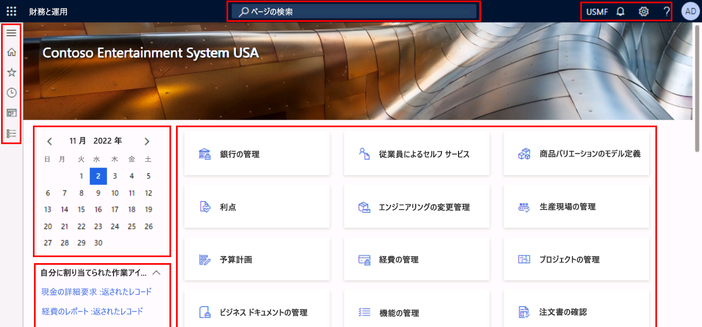
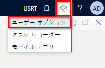
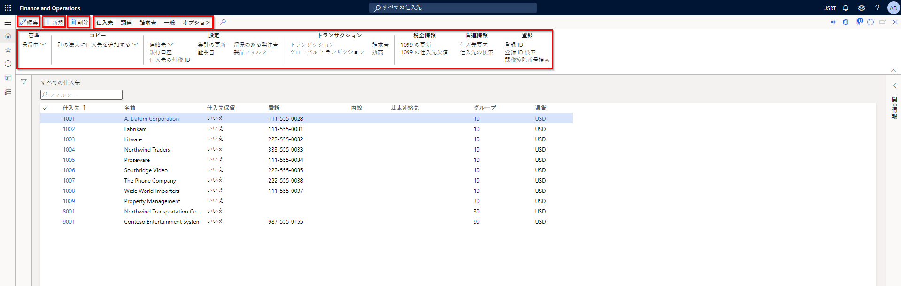
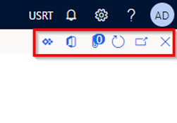

---
lab:
    title: 'ラボ 1: Finance and Operations アプリでのナビゲーション'
    module: 'モジュール 1: Microsoft Dynamics 365 Supply Chain Management の基礎を学ぶ'
---

# モジュール 1: Microsoft Dynamics 365 Supply Chain Management の基礎を学ぶ

## ラボ 1 - Finance and Operations アプリでのナビゲーション

## 目的

Finance and Operations アプリに馴れたところでインターフェイスを調べてみましょう。

## ラボの設定

- **「推定時間」**: 10 分

## 手順

### ラボのコンピュータへのログイン

1. 次の資格情報でラボのコンピュータにサインインします。

    - ユーザー名:

        コンテンツ貼り付け

        Administrator

    - パスワード:

        コンテンツ貼り付け

        pass@word1

    >「!メモ」 Internet Explorer はデスクトップに自動的に開くことがあります。  #2-5 の手順をまだ終えていなければ、まず終えてから Internet Explorer へ戻ってください。

1. デスクトップにある **「AdminUserProvisioning」** ファイルを選択します。

1. 提供された資格情報を入力して **「送信」** を選択します。  
資格情報は画面右上にある **「リソース」** メニューで見つかります。

1. 次へ進む前に、スクリプトが完了するのを待ちます。2 ～ 3 分かかる場合があります。スクリプトが完了すると、管理者ユーザーの更新完了を確認するポップアップボックスが出ます。

1. **「OK」** を選択して続行します。

1. **Internet Explorer** を開きます。

1. 所与のリンク先を開きます: <https://usnconeboxax1aos.cloud.onebox.dynamics.com>

1. **「リソース」** メニューに示された資格情報でサインインします。

### Finance and Operations アプリでのナビゲーション
1. Finance and Operations 「ホーム」ページに構成されている場合は次の情報が表示されます。

    - 既定で折りたたまれている、左側のナビゲーション メニュー。

    - 会社のロゴ。

    - 組織における役割に基づいて利用できるワークスペース タイル。

    - 割り当てられているカレンダーおよび作業項目。

    - 必要な情報をすぐに見つけるのに非常に便利な検索バー。

    - 右上には、現在勤務している会社、通知、設定、ヘルプ リンクがあります。  
    上場企業が **USMF** であることを確認します。

    

1. 左上で、**「ナビゲーション ペインの展開」** ハンバーガー メニューを選択します。

1. ナビゲーション ペインには、**「お気に入り」**、**「最近使った」** 項目、**「ワークスペース」**、**「モジュール」** のコレクションがあります。

1. ナビゲーション ペインで、**「モジュール」** > **「システム管理」** を選択します。

1. システム管理モジュールで使用できる領域を確認します。

1. **「設定」** で、**「クライアント パフォーマンス オプション」** を選択します。

1. クライアント パフォーマンス オプション ペインの**機能のコールアウトが有効化されました**の下で、トグル スイッチを選択して、**はい**に設定されていることを確認します。

1. その他の使用可能なオプションを確認し、ペインの一番下までスクロールして、**「OK」** を選択します。

1. 「ホーム」ページの右上で、設定アイコンを選択してからユーザー オプションを選択します。

    

1. 「オプション」ページのタブを使用して、アカウントに適用されるさまざまな設定を構成します。

1. **「基本設定」** タブを選択します。

1. 使用できる基本設定を確認します。サインイン時に表示される既定の会社および初期ページ ビューは変更できる点に注目してください。

1. **「アカウント」** タブと **「ワークフロー」** タブを選択および確認します。

1. 左側のナビゲーション メニューで、**ホーム** アイコンを選択します。

1. 「ホーム」ページの上中央で、**「ページの検索」** ボックスを選択します。

1. 検索ボックスで、**「すべての仕入先」** を検索します。

1. ページを初めて検索する場合は、少し時間がかかることがあります。検索中、検索ボックスの右側に小さな回転円が表示されます。

1. 「すべての仕入先」ページは、リスト ページの例です。リスト ページには通常、読み取り、作成、削除、更新が可能なマスター データが表示されます。リストの上に表示されたリボンを使うと、その他の機能が表示されます。

    

1. リストから仕入先を 1 つ強調表示し、右側の **「関連情報」** メニューを選択して、表示された追加情報を確認します。

1. 仕入先リストで、**「Acme Office Supplies」** を選択します。

1. **「グループ」** メニューを選択し、**「仕入先グループ」** 列タイトルを選択します。

    

1. 多くのメニューで並べ替えやフィルター処理を使用できます。検索するフィールド コンテンツをすばやく見つけるには、フィルターを使います。

1. 右上の追加機能に注目してください。各項目にマウスを移動し、機能の呼び出しを確認します。完了したら、**「閉じる」** アイコンを選択してページを閉じ、「ホーム」ページに戻ります。

    

1. 右上にある **ヘルプ** (疑問符) アイコンを選択し、**ヘルプ** を選択します。

1. ヘルプ情報が現在のページに関連していることを確認します。

1. ワークスペース タイルを選択した後、そのワークスペースのヘルプ情報を確認してみてください。完了したら、「ホーム」ページに戻ります。
