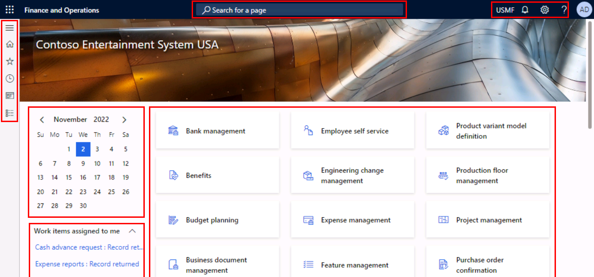

---
lab:
  title: 'ラボ 1:Finance and Operations アプリでのナビゲーション'
  module: 'Module 1: Explore the core capabilities of Dynamics 365 finance and operations apps'
---

# モジュール 1:Dynamics 365 財務と運用アプリの主な機能を調べる

## ラボ 1:Finance and Operations アプリでのナビゲーション

## 目的

Finance and Operations アプリに馴れたところでインターフェイスを調べてみましょう。

## ラボのセットアップ

- **推定時間**:10 分

## Instructions

### ラボのコンピュータへのログイン

1.  次の資格情報でラボのコンピューターにサインインします。

    - ユーザー名: `Administrator`

    - パスワード: `pass@word1`

1.  次へ進む前に、AdminUserProvisioning スクリプトが完了するのを待ちます。 2 ～ 3 分かかる場合があります。 スクリプトが完了すると、管理者ユーザーの更新完了を確認するポップアップボックスが簡単に表示されます。 

1.  **Microsoft Edge** によって、Finance & Operations URL が開きます: <https://usnconeboxax1aos.cloud.onebox.dynamics.com>

1.  **[リソース]** メニューの [ユーザー名] と [パスワード] を使用してサインインします。 

### Finance and Operations アプリでのナビゲーション

1.  **Finance and Operations** ホーム ページに次の情報が表示されます。 

    - 既定で折りたたまれている、左側のナビゲーション メニュー。 

    - 会社の既定のバナー画像。 

    - 組織における役割に基づいて利用できるワークスペース タイル。 

    - 割り当てられているカレンダーおよび作業項目。 

    - 必要な情報をすぐに見つけるのに非常に便利な **[検索ページ]** バー。 

    - 右上には、現在勤務している会社、通知、設定、ヘルプ リンクがあります。 

    

1.  上場企業が **USMF** であることを確認します。 

1.  左上で、**[ナビゲーション ペインの展開]** ハンバーガー メニューを選択します。 

1.  ナビゲーション ペインには、**[お気に入り]**、**[最近使った]** 項目、**[ワークスペース]**、**[モジュール]** のコレクションがあります。 

1.  ナビゲーション ペインで、**[モジュール]**、**[システム管理]** の順に選択します。 

1.  **[システム管理]** モジュールで使用できる各種の領域を**確認**します。 

1.  **[設定]** で、**[クライアント パフォーマンス オプション]** を選択します。 

1.  [クライアント パフォーマンス オプション] ペインの **[機能のコールアウトが有効化されました]** で、トグル スイッチを選択し、 **[はい]** に設定します。 

1.  その他の使用可能なオプションを確認し、ペインの一番下までスクロールして、 **[OK]** を選択します。 

1.  [ホーム] ページの右上で、 **[設定]** アイコンを選択して、 **[ユーザー オプション]** を選択します。 

    

1.  **[ユーザー オプション]** ページのタブを使用して、アカウントに適用されるさまざまな設定を構成します。 

1.  **[基本設定]** タブを選択します。 

1.  使用できる基本設定を確認します。 サインイン時に表示される既定の **[会社]** および **[初期ページ]** は変更できる点に注目してください。 

1.  **[アカウント]** タブと **[ワークフロー]** タブを選択し、確認します。 

1.  左側のナビゲーション メニューで、**ホーム** アイコンを選択します。 

1.  [ホーム] ページの上中央で、**[ページの検索]** ボックスを選択します。 

1.  検索ボックスで、`All vendors` を検索します。 

1.  ページを初めて検索する場合は、少し時間がかかることがあります。 検索中、検索ボックスの右側に小さな回転円が表示されます。 

1.  最初の結果 **[すべての仕入先]** を選択します。これは、 **[モジュール]**  >  **[買掛金勘定]**  >  **[仕入先]**  >  **[すべての仕入先]** の順に移動する場合と同じです。 

1.  **[すべての仕入先]** ページは、リスト ページの例です。 リスト ページには通常、読み取り、作成、削除、更新が可能なマスター データが表示されます。 一覧の上にあるアクション ウィンドウを使用すれば、追加で提供されている機能を確認できます。 

    

1.  リストから仕入先を 1 つ強調表示し、右側の **[関連情報]** FactBox ウィンドウを選択して、表示された追加情報を確認します。 

1.  仕入先一覧で、**Acme Office Supplies** レコードを開きます。 

1.  アクション ウィンドウで **[編集]** を選択し、 **[グループ]** フィールドでドロップダウン メニューを選択して、 **[仕入先グループ]** 列のタイトルを選択します。 

    

1.  多くのメニューで**並べ替え**や**フィルター処理**を使用できます。 検索するフィールド コンテンツをすばやく見つけるには、フィルターを使います。 値が既にわかっている場合は、ドロップダウン メニューを使用するのではなく、フィールドに入力するだけで済みます。 

1.  アクション ウィンドウの右側に表示される追加の機能に注目してください。 各項目にマウス ポインターを合わせ、機能の吹き出しを確認します。 

1.  **[閉じる]** アイコンを選択してこのレコードを閉じ、 **[すべての仕入先]** リスト ページに戻ります。 

    ![Power Apps、Office アプリへの接続、添付ファイル、[更新]、[新しいウィンドウで開く]、[閉じる] ボタンの追加機能を示すリスト ページの右上メニュー](./media/m1-common-list-page-additional-features-menu.png)

1.  右上で、 **?** を選択します。 疑問符アイコンをクリックして、 **[ヘルプ]** を選択します。 

1.  ヘルプ情報ウィンドウに現在のページの内容が表示されていることに注目してください。 [ヘルプ] ウィンドウを**閉じます**。 

1.  左上の **[Finance and Operations]** ボタンまたは左側のナビゲーション メニューの **[ホーム]** アイコンを使用して、 **[既定のダッシュボード]** に戻ります。 

    > **注:** キーボード ショートカット: Alt + Shift + Home。 Dynamics 365 Finance and Operations では、システムへのアクセスを高速化するための多くのキーボード ショートカットがサポートされています: https://learn.microsoft.com/en-us/dynamics365/fin-ops-core/fin-ops/get-started/shortcut-keys

1.  **ワークスペース タイル**を選択した後、そのワークスペースのヘルプ情報を確認してみてください。 完了したら、既定のダッシュボードに戻ります。 

