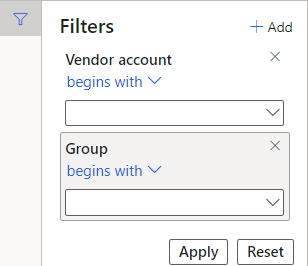

---
lab:
  title: ラボ 2:ワークスペースとフィルタリングについて調べる
  module: 'Module 1: Learn the Fundamentals of Microsoft Dynamics 365 Supply Chain Management'
ms.openlocfilehash: 0a2815e312b9798dcf93ec6cee669eb65a1f9942
ms.sourcegitcommit: 252458fca8e71b6e5e8b99ae4c2b47cd85461a30
ms.translationtype: HT
ms.contentlocale: ja-JP
ms.lasthandoff: 01/27/2022
ms.locfileid: "137909924"
---
# モジュール 1:Microsoft Dynamics 365 Supply Chain Management の基礎を学ぶ

## ラボ 2 - ワークスペースとフィルター処理を詳しく知る

## 目標

Finance and Operations に初めてログインするとき、多くの組み込みワークスペースを利用できます。 必要な内容に重点を置いた独自のワークスペースを作成することもできます。 ワークスペースは、Dynamics 365 が持つ多くの機能の 1 つですが、フィルター処理すると、探している特定の品目に実際にアクセスしやすくなります。 パーソナライズされた新しいワークスペースを作成し、フィルター処理を使って必要とするさまざまな品目を特定する必要があります。

## ラボのセットアップ

   - **推定時間**:10 分

## Instructions

1. Finance and Operations 「ホーム」ページのワークスペース タイルの右側で、空白の領域を右クリックするか長押しすると、メニューが表示されます。

    

1. メニューで、 **[パーソナライズ:TilePageContainer]** を選択します。

1. 「パーソナライズ」ウィンドウで、 **「+ ワークスペースの追加」** を選択します。

1. 小さいパーソナライズ ウィンドウが表示されない場合、[ホーム] ページを上にスクロールして右クリックまたは長押しし、 **[パーソナライズ:TilePageContainer]** を再度選択します。

    

1. 「ホーム」ページで、下にスクロールして、新しい **「マイ ワークスペース 1」** タイルを見つけます。

    

1. タイルを右クリックまたは長押しし、 **[パーソナライズ:マイ ワークスペース 1]** を選択します。

1. パーソナライズ ウィンドウで、「ワークスペース 1」の名前を **「マイ ワークスペース」** に変更し、 **「このページのパーソナライズ」** を選択します。  
    名前の変更は自動的に保存されます。

1. 新しく開いたツール バーで **「移動」** を選択します。

    

1. **「マイ ワークスペース」** タイルを選択し、「ホーム」ページの別の場所に移動します。

    >[!Note] タイルが動かない場合は、ページを更新して上の手順を再度実行して、タイルを動かしてください。

1. ツール バーを閉じます。

1. 「ホーム」ページの **「ページの検索」** ボックスで、 **「すべての仕入先」** を検索して選択します。

1. すべての仕入先ページの上部メニューで、 **「オプション」**  >  **「ワークスペースに追加」** を選択します。

1. **「ワークスペー」ス** フィルター ボックスに、 **「マイ ワークスペース」** と入力し、ワークスペースを選択します。

1. 「プレゼンテーション」メニューを選択して利用可能なオプションを確認し、 **「タイル」** を選択します。

1. 完了したら、 **「構成」** を選択します。

1. 「タイルとして追加」ペインで、タイルの名前を確認し、 **「OK」** を選択します。

1. 左側のナビゲーション ペインで、**ホーム** アイコンを選択します。

1. 「ホーム」ページで、新しいワークスペースを選択します。

1. 「マイ ワークスペース」ページで、新しく追加された 「仕入先」タイルが表示されているのを確認します。

1. **「仕入先」** タイルを選択します。

1. すべての仕入先ページの **「フィルター」** ボックスに、 **「Contoso」** と入力します。

1. Contoso の検索に使用できるさまざまなフィールドを確認します。

    

1. **名前:「Contoso」** を選択し、フィルターの結果を確認します。

1. フィルター ボックスをオフにし、Enter キーを押してすべての仕入先を表示します。

1. 列のタイトル **「グループ」** を選択します。

    

1. これを使って、グループを降順 (A から Z に並べ替え) または昇順 (Z から A に並べ替え) に並べ替えることができます。

1. **「グループ」** で、 **「次の値で始まる」** メニューを選択し、比較演算子を確認します。 **「次の値と完全に一致する」** を選択します。

1. **「次の値と完全に一致する」** の下のメニューを選択し、 **「他の仕入先」** を選択します。  
    または、"メニュー" フィールドに値を入力できます。

1. **「適用」** を選択し、結果を確認します。 グループ列ヘッダーのフィルター アイコンに注目してください。

    

1. **「グループ」** 列を選択し、フィルター メニューで **「クリア」** を選択します。

1. 「すべての仕入先」タイルの左側にある 「フィルター」アイコンを選択します。

    

1. 「フィルター」ペインの右上で、 **「+ 追加」** を選択します。

1. 「フィルター フィールドの追加」ペインで、 **「グループ」** の左にあるチェック ボックスをオンにし、「更新」を選択します。

1. 追加された追加のフィルターに注目してください。 これを使うと、複数の基準に基づいて一覧をフィルター処理できます。

    

1. **「仕入先勘定は次の値で始まる」** フィルターで、メニューを選択し、 **「北風トレーダー」** を選択します。

1. **「グループは次の値で始まる」** フィルターで、メニューを選択し、 **「30」** を選択します。

1. **「適用」** を選択し、フィルター結果を確認します。

1. 「フィルター」ペインで **「リセット」** を選択し、追加のフィルターが削除されて、既定のフィルターが空の値に リセットされていることを確認します。

1. リボン バーで **「オプション」** を選択し、「ページ オプション」セクションで、 **「フィルターまたは並べ替えの編集」** を選択します。

    

1. 「照会 - 仕入先」ウィンドウで、 **+ 追加** を選択します。

1. 新しい行の フィールド セルで、メニューを選択し、 **「グループ」** を選択します。

1. または、メニューを選択して、グループの名前の入力を開始し、フィルターの結果から選択することもできます。

1. 「基準」セルで、 **「開く」** アイコンを選択します。

    

1. 「仕入先グループ」リストで、 **「他 30 件の仕入先」** を選択します。

1. 新しいクエリを保存するには、 **「クエリの選択」** で **「変更」** メニューを選択し、 **「名前を付けて保存」** を選択します。

    

1. 「クエリの保存」ペインの **「名前」** ボックスに、「マイ クエリ」と入力し、**OK** を選択します。

1. 「照会 - 仕入先」ページで、 **「OK」** を選択します。

1. 新しく作成されたクエリの結果が一覧に反映されていることを確認します。

1. フィルターを削除するには、 **「フィルターまたは並べ替えの編集」** を選択し、「照会 - 仕入先」ページで **「リセット」** を選択して **「OK」** を選択します。

1. これによりクエリがリセットされますが、保存されているクエリは削除されません。
