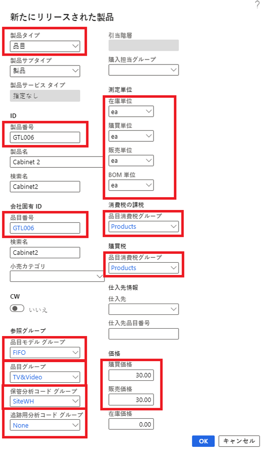
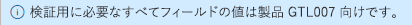

---
lab:
    title: 'ラボ 3: 製品内容をさまざまなサイズと色で作成する'
    module: 'モジュール 1: Microsoft Dynamics 365 Supply Chain Management の基礎を学ぶ'
---

# モジュール 1: Microsoft Dynamics 365 Supply Chain Management の基礎を学ぶ

## ラボ 3 - 新製品を作成する

## 目的

Contoso Entertainment System USA (USMF) で、キャビネットの構成を変更するために、仕入先から新しく購入する品目を作成する必要があります。

## ラボの設定

   - **「推定時間」**: 10 分

## 手順

1. Finance and Operations の「ホーム」ページの右上で、USMF 社の作業を行っていることを確認します。

1. 必要な場合、会社を選び、メニューから **USMF** を選択します。

1. 左上で、**「ナビゲーション ペインの展開」** ハンバーガー メニューを選択します。

1. ナビゲーション ウィンドウで、**「モジュール」** > **「製品情報管理」** を選択し、**「製品」** カテゴリから **「リリースされた製品」** を選択します。

1. リリース済み製品の詳細ページのトップ メニューから **「+ 新規」** を選択します。

1. 「新しいリリース済み製品」ペインの **「製品タイプ」** メニューで、**「品目」** が選択されていることを確認します。

1. **「製品サブタイプ」** メニューで、**「製品」** が選択されていることを確認します。

1. **「追跡用分析コード グループ」** メニューを選択し、**「なし」** を選択します。

1. **「ID」** の **「製品番号」** ボックスに **「GTL007」** と入力します。

1. **「製品名」** ボックスに **「キャビネット 2」** と入力します。

1. **「参照グループ」** で、**「品目モデル グループ」** メニューを選択し、**「FIFO (先入れ先出し)」** を選択します。

1. **「品目グループ」** メニューを選択し、**「TV&Video」** を選択します。

1. **「保管分析コード グループ」** メニューを選択し、**「SiteWH」** を選択します。

1. **「測定単位」** で、次の値が設定されていることを確認します。

    | **設定**| **値**|
    | :--- | :--- |
    | 在庫単位| それぞれ|
    | 購買単位| それぞれ|
    | 販売単位| それぞれ|
    | BOM 単位| それぞれ|

1. **「消費税」** で **「品目消費税グループ」** メニューを選択し、**「すべて」** を選択します。

1. **「購買税」** で **「品目消費税グループ」** を選択し、**「すべて」** を選択します。

1. 「価格」の「購買価格」ボックスに「30.00」と入力します。

1. 「販売価格」ボックスに「30.00」と入力します。

1. 新しいリリース製品は、次のように表示されます。

    

1. **「OK」** を選択します。

1. 製品が確定されたことを確認するために、リボン バーの **「管理」** で、**「検証」** を選択します。

    

1. 情報バナーが表示され、検証に必要なすべてのフィールド値が指定されたことを確認できます。

    

1. すべてのページを閉じて、「ホーム」ページに戻ります。
