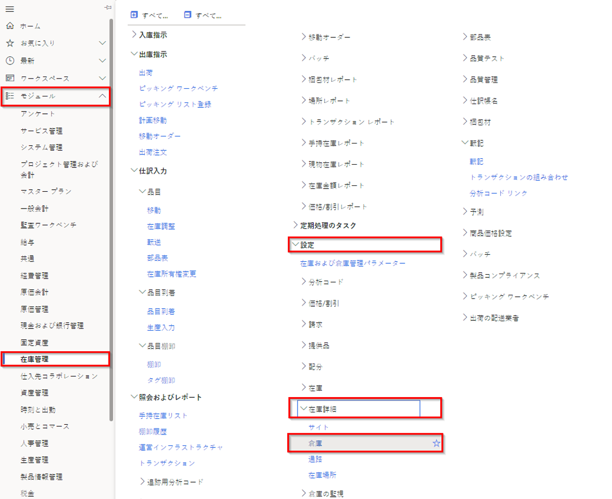

---
lab:
  title: ラボ 5:倉庫の作成
  module: 'Module 1: Learn the Fundamentals of Microsoft Dynamics 365 Supply Chain Management'
ms.openlocfilehash: 919ea602b0768683acd845dd184b3bf5a0364fd0
ms.sourcegitcommit: 252458fca8e71b6e5e8b99ae4c2b47cd85461a30
ms.translationtype: HT
ms.contentlocale: ja-JP
ms.lasthandoff: 01/27/2022
ms.locfileid: "137909761"
---
# モジュール 1:Microsoft Dynamics 365 Supply Chain Management の基礎を学ぶ

## ラボ 5 - 倉庫を作成する

## 目標
Supply Chain Management の倉庫管理システムを使用すると、変化するニーズを満たすように倉庫のレイアウトを定義して、最適な倉庫の効率を確保することができます。

- 商品を最大限に配置するために、優先順位の高いストレージ領域と優先順位の低いストレージ領域を確立できます。
- さまざまなストレージ ニーズ (温度要求、品目に対するさまざまな回転率など) に対応するように、倉庫をゾーンに分割できます。
- あらゆるレベル (サイト、倉庫、通路、ラック、棚、在庫置場など) で倉庫の場所を指定できます。
- 物理的な容量の制約設定を使用して、場所をグループ化できます。
- クエリ定義のルールに基づいて、品目を格納および選択する方法を制御できます。

Supply Chain Management で倉庫管理を使用するには、倉庫を作成して、より高度な、または特殊な倉庫管理活動を可能にする必要があります。

## ラボのセットアップ

   - **推定時間**:10 分

## Instructions

1. Finance and Operations の [ホーム] ページの右上で、USMF 社の作業を行っていることを確認します。

1. 必要な場合、会社を選び、メニューから **USMF** を選択します。

1. 左ナビゲーション ペインで、**モジュール** > **在庫管理** > **設定** > **在庫内訳** > **倉庫** を選択します。

    

1. 倉庫のページのトップ メニューで **新規** を選択します。

1. **[倉庫]** フィールドに「**101**」と入力します。

1. **名前** フィールドに、**オーバーフロー倉庫** と入力します。

1. **[サイト]** メニューを選択し、 **[3 ホーム フォーム生産]** を選択します。

1. **場所名** を展開します。  
    このセクションのオプションは、場所名の既定形式を定義します。

1. **通路を含める** と **ラックを含める** オプションを **はい** に設定します。

1. **形式** ボックスにラックの値を入力します。  
    たとえば、ラックの場所名の形式に OVFL を含まなければならない場合、この値は [形式] ボックスに入力します。

1. **[レベル]** の **[棚を含める]** オプションを **[はい]** に設定します。

1. **形式** フィールドに棚の **-##** を入力します。

1. トップ メニューで **倉庫** を選択します。

    

1. **管理** で、**場所ウィザード** を選択します。

1. ようこそページで情報を確認し、右下隅の **次へ** を選択します。

1. **出荷ドック** と **バルク場所** のチェック ボックスをオフにします。

1. **次へ** を選択し、情報を確認します。

1. 各ページに進み、完了したら **終了** を選択します。

1. ページを閉じて、[ホーム] ページに戻ります。
