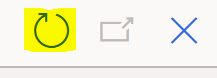
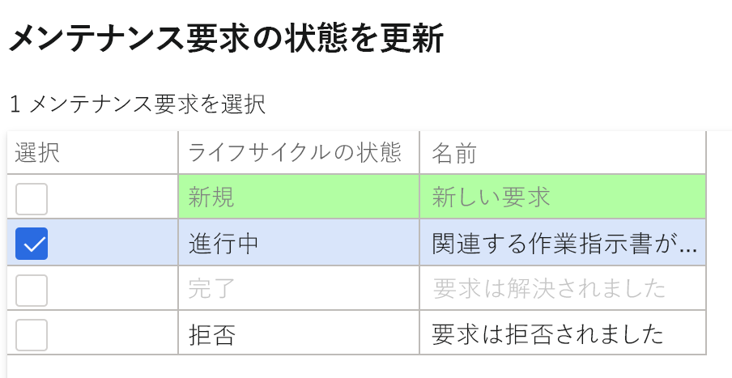
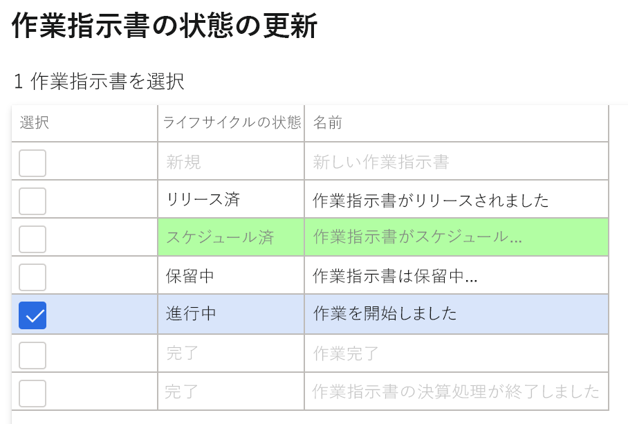
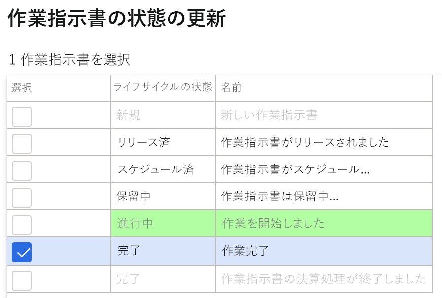

---
lab:
  title: ラボ 7:保全された作業指示書の作成
  module: 'Module 1: Learn the Fundamentals of Microsoft Dynamics 365 Supply Chain Management'
ms.openlocfilehash: ae848333194143720a6f5ebb598d5d566bc2260f
ms.sourcegitcommit: 252458fca8e71b6e5e8b99ae4c2b47cd85461a30
ms.translationtype: HT
ms.contentlocale: ja-JP
ms.lasthandoff: 01/27/2022
ms.locfileid: "137909996"
---
## ラボ 7 - 保全された作業指示書の作成

**目標**

資産に必要なメンテナンスまたは修理を説明し、メンテナンス要求を完了するための適切なリソースを割り当てる、システムに配置されたメンテナンスの指示書。 作業指示書は、割り当てられたリソースによって実行されるメンテナンスの指示書に基づいて作成されます。

**ラボのセットアップ**

推定時間:15 分

**手順**

1. Finance and Operations の [ホーム] ページの右上で、USMF 社の作業を行っていることを確認します。

2. 必要な場合、会社を選び、メニューから **USMF** を選択します。

3. 左のナビゲーションペインから、 **[モジュール]** **&gt;[資産管理] &gt; [セットアップ] &gt; [メンテナンス要求] &gt; [ライフサイクル状態]** を選択します。

4. [InProgress] を選択し、操作ペインの **[編集]** ボタンをクリックします。

5. **[全般]** タブで、 **[作業指示書を作成する]** の値を [はい] に変更します。

6. 左のナビゲーションペインから、 **[モジュール]** **&gt; [資産管理] &gt; [ワークスペース] &gt; [メンテナンス要求管理]** を選択します。

7. **[メンテナンス要求を作成する]** をクリックします。

8. ダイアログのフィールドに次の値を入力し、 **[OK]** ボタンをクリックします。

    - メンテナンス要求タイプ:修正

    - 説明: 金属探知機のノイズ

    - 機能の場所:PP-02-02

    - 資産:MD-201

    - サービス レベル:4

    - 障害の兆候:過度のノイズ

    - 障害領域:電気 

9. **メンテナンス要求** フォームを閉じて、**メンテナンス要求管理** ワークスペースに戻ります。

10. 画面の右上隅にある **更新** アイコンを押してページを更新します。

11. 新しいメンテナンス要求は、作業指示書なしでメンテナンス要求のリストに表示されます。

12. 新しく作成されたメンテナンス要求を選択し、 **[メンテナンス要求の状態を更新する]** ボタンをクリックします。 

13. ダイアログで、InProgress の隣にあるチェックボックスを選択し、 **[OK]** をクリックします

 

14. 新しく作成されたメンテナンス要求を選択し、 **[作業指示書を作成する]** ボタンをクリックします。 

15. ダイアログのフィールドに次の値を入力し、 **[OK]** ボタンをクリックします。

    - メンテナンス作業タイプ:検査

16. 新しい作業指示書が作成され、選択されたメンテナンス要求レコードで作業指示書が更新されます。

17. 作業指示書をクリックして、**作業指示書の詳細** 画面に移動します。

18. 作業指示書の下の **[ディスパッチ]** ボタンをクリックします。

19. ダイアログのフィールドに次の値を入力し、 **[OK]** ボタンをクリックします。

    - 作業者:Ted Howard

20. [アクション] メニューで、 **[作業指示書] &gt; [ライフサイクル状態] &gt; [作業指示書の状態を更新する]** に移動します。

21. ダイアログで、InProgress の隣にあるチェックボックスを選択し、 **[OK]** をクリックします

22. ダイアログボックスで **実際の開始** 日時を選択し、 **[OK]** をクリックします。

23. 作業指示書アクション メニューから、 **[作業指示書] &gt; [ライフサイクル状態] &gt; [作業指示書の状態を更新する]** に再度移動します。

24. ダイアログで、Completed の隣にあるチェックボックスを選択し、 **[OK]** をクリックします

25. **[実際の完了]** フィールドで、開始日時よりも後の日時を選択し、[OK] をクリックします。

26. 作業指示書ヘッダーで、現在のライフサイクル状態が完了していることが表示されます。
