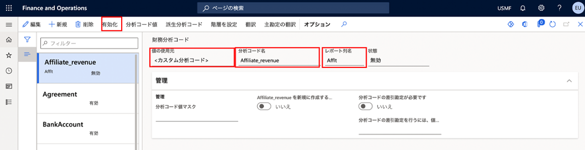
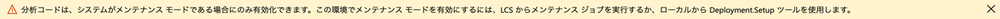

---
lab:
    title: 'ラボ 1: 財務分析コードの作成'
    module: 'モジュール 2: Microsoft Dynamics 365 Finance の基礎を学ぶ'
---

## ラボ 1 - 財務分析コードの作成

## 目的

勘定科目表で勘定セグメントとして使用できる財務分析コードを作成するには、「財務分析コード」ページを使用します。財務分析コードには、カスタム分析コードとエンティティに基づく分析コードの 2 つのタイプがあります。カスタム分析コードは法人間で共有され、値はユーザーによって入力および管理されます。エンティティに裏付けられた分析コードの場合、値はシステム内のどこか (顧客や店舗エンティティなど) で定義されます。エンティティに基づく分析コードは、法人全体で共有されるものと会社固有のものがあります。

あなたの会社が使用するためのカスタムの財務分析コードを作成していただきます。

## ラボの設定

   - **「推定時間」**: 5 分

## 手順

1. Finance and Operations の「ホーム」ページの右上で、USMF 社の作業を行っていることを確認します。

1. 必要な場合、会社を選び、メニューから **USMF** を選択します。

1. 左ナビゲーション ウィンドウで、**「モジュール」** > **「総勘定元帳」** > **「勘定科目表」** > **「分析コード」** > **「財務分析コード」** の順に選択します。

1. 上部メニューで、**「+ 新規」** を選択します。

1. 「財務分析コード」 ページで **「値の使用元」** メニューを選択し、**< カスタム分析コード >** を選択します。

1. **「分析コード名」** ボックスに **「Affliate_Revenue」** と入力します。

1. **「レポート列名」** ボックスに、**「Afflt」** と入力します。

1. トップ メニューで **「アクティブ化」** を選択します。

    

1. ダイアログ ボックスの情報を確認し、**「閉じる」** を選択します。

1. 警告通知のバナーを確認します。

    

    >「!メモ」メンテナンス モードのオン/オフは、ご使用のサンドボックスおよび実稼働環境の Lifecycle Services (LCS) から直接切り替えることができます。ライフサイクル サービスの管理に関する詳しい情報の参照先「[https://docs.microsoft.com/ja-jp/dynamics365/fin-ops-core/dev-itpro/deployment/maintenanceoperationsguide-newinfrastructure」](https://docs.microsoft.com/ja-jp/dynamics365/fin-ops-core/dev-itpro/deployment/maintenanceoperationsguide-newinfrastructure)。
