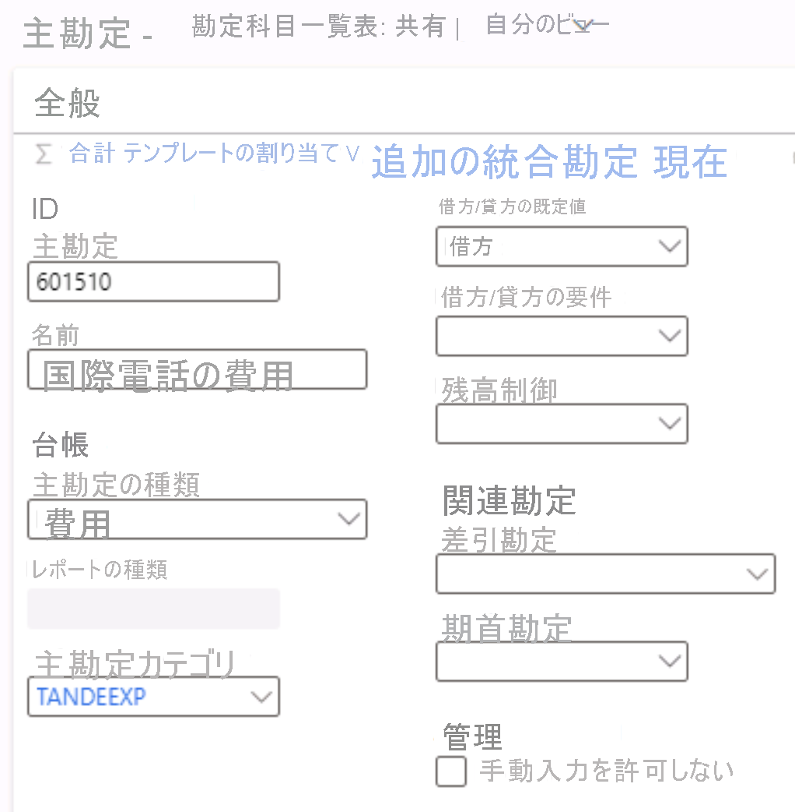

---
lab:
  title: ラボ 1:主勘定を作成する
  module: 'Module 2: Learn the Fundamentals of Microsoft Dynamics 365 Finance'
ms.openlocfilehash: 6568afcb26212ab952a48dfaf7bb4f377e4ffd36
ms.sourcegitcommit: aa74c0578c7018838f0c935f5901e9c667ef0801
ms.translationtype: HT
ms.contentlocale: ja-JP
ms.lasthandoff: 07/14/2022
ms.locfileid: "147116653"
---
# モジュール 2:Microsoft Dynamics 365 Finance の基礎を学ぶ
    
## ラボ 1 - 主勘定を作成する

## Instructions

1. **Finance and Operations 「ホーム」** ページの右上で、USMF 社の作業を行っていることを確認します。

2. 必要な場合、会社を選び、メニューから **USMF** を選択します。

3. 左側のナビゲーション ウィンドウで **[モジュール]**  >  **[総勘定元帳]**  >  **[勘定科目表]**  >  **[勘定]**  >  **[主勘定]** を選択します。

4. 上部メニューで、**[+ 新規]** を選択します。

5. [主勘定] ページに次の値を入力します。

    - 主勘定:**601510**

    - 名前: **International call expense**

    - 主な経費の種類: **[Expense]**

    - 主勘定カテゴリ:**TANDEEXP**

    - 借方/貸方の既定値:**Debit**

 
