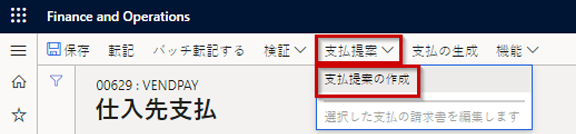
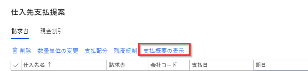
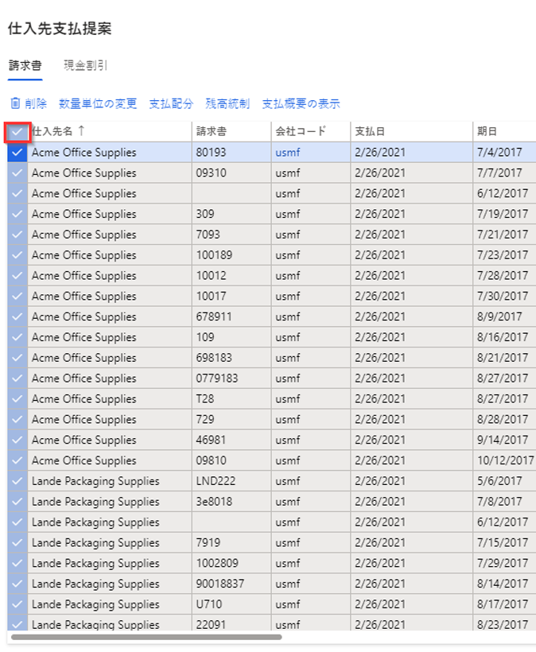
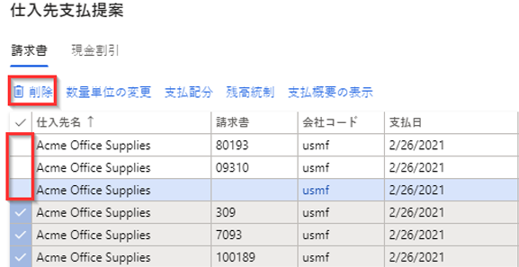

---
lab:
  title: ラボ 2:仕入先支払仕訳帳を作成する
  module: 'Module 2: Learn the Fundamentals of Microsoft Dynamics 365 Finance'
ms.openlocfilehash: cc38bf9c77d8b5d45e8a27f0a8f766d7834e065a
ms.sourcegitcommit: 252458fca8e71b6e5e8b99ae4c2b47cd85461a30
ms.translationtype: HT
ms.contentlocale: ja-JP
ms.lasthandoff: 01/27/2022
ms.locfileid: "137910089"
---
## ラボ 2 - 支払仕訳帳の作成

## 目標

定期的に仕入先支払を行う組織は仕入先支払提案書を自動作成できるようになりました。 仕入先支払提案書の自動化では次の項目を定義します。

- 支払提案書の実行時期
- 支払うべき請求書の選択基準
- 支払を保存する支払仕訳帳

仕入先支払提案書の自動化では支払が自動記録されるわけではありません。 つまり、作成した支払の承認にこれまで使用してきた妥当性検証とワークフロー工程を継続的に使用することができます。

新規支払仕訳帳の勘定と支払提案書を作成します。

## ラボのセットアップ

   - **推定時間**:10 分

## Instructions

1. Finance and Operations 「ホーム」ページの右上で、USMF 社の作業を行っていることを確認します。

1. 必要な場合、会社を選び、メニューから **USMF** を選択します。

1. 左側のナビゲーション ペインで、**モジュール** > **買掛金勘定** > **支払** > **仕入先支払仕訳帳** を選択します。

1. 上部メニューで、 **「+ 新規」** を選択します。

1. 新しい仕訳帳バッチ番号が作成されたことを確認します。

1. **「名前」** ボックスに **「Vend」** と入力し、フィルター処理された一覧から **「VendPay」** を選択します。

1. 上部メニューで、 **「明細行」** を選択します。

1. 「仕入先支払」ページの上部メニューで、 **「支払提案」**  >  **「支払提案の作成」** を選択します。  
    支払提案は、支払請求書を選択するために使用されるクエリです。 仕入先支払を作成または生成する前に、支払う請求書の一覧を編集できます。

    

1. 「仕入先支払提案」ペインの **「請求書の選択基準」** で、 **「請求書の選択」** メニューを選択し、使用できるオプションを確認して、 **「期日」** を選択します。

1. **「開始日」** および **「終了日」** で、既存の値を削除します。 この演習でこれらの日付は空白のままにします。

    >[!NOTE] 最短支払期日は支払日として使用できます。 最短支払期日は、支払の作成時に使用する支払最短日になります。 たとえば、請求書の期限が最短支払期日より後の場合、できるだけ早い日に請求書を支払う最短支払期日ではなく、請求書の期限が支払日になります。

1. **「対象に含めるレコード」** を展開してオプションを確認します。  
    ほとんどの場合、このフィルターは、仕入先グループまたは支払方法別に支払うように選択した請求書の制約に使用されます。 たとえば、この支払の実行では小切手で支払う請求書だけを残すようにフィルターを追加できます。

1. **「詳細パラメーター」** を展開し、使用可能なオプションを確認します。  
    追加のパラメーターを使用して、支払通貨を定義したり、この支払実行で集中支払を有効にしたりすることができます。

1. **[OK]** を選択します。  
    OK を選択すると、クエリの結果が表示されます。 支払が選択された請求書のリストをプレビューしない場合は、「パラメーター」クイック タブに戻って、 **「請求書をプレビューせずに支払を作成する」** を **「はい」** に変更できます。

1. 仕入先支払提案ウィンドウで、 **「支払概要の表示」** を選択して、選択した請求書の仕入先に対して作成される請求書を表示します。

    

1. メニューで、 **「支払概要の非表示」** を選択して、支払を非表示にします。

1. **「仕入先名」** 列のヘッダーの左側にあるチェック マーク アイコンを選択して、すべての請求書を選択します。

    

1. 最初の 3 つの請求書のチェック ボックスをオフにして、メニューの **「削除」** を選択し、他のすべての請求書を削除します。

    

1. ダイアログ ボックスで **[はい]** を選択します。

1. 残りの 3 つの請求書を確認します。

1. 請求書の一覧を Excel にエクスポートするには、グリッドを右クリックして、エクスポート オプションを選択します。

1. 右下隅で **「支払の作成」** を選択して、支払仕訳帳に仕入先支払を作成します。

1. 仕入先支払の一覧を確認します。
