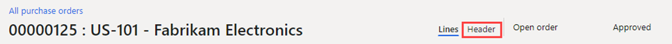

---
lab:
  title: 'ラボ 2:発注書の作成'
  module: 'Module 3: Learn the Fundamentals of Microsoft Dynamics 365 Supply Chain Management'
---

# モジュール 3:Microsoft Dynamics 365 Supply Chain Management の基礎を学ぶ

## ラボ 2:発注書の作成

## ラボのセットアップ

   - **推定時間**:15 分

## 目的

このラボでは、ユーザー インターフェイスと、発注書フォームで使用できるさまざまなフィールドについての理解を深めます。 また、新しい発注書を作成する方法についても学習します。

## ラボのセットアップ

   - **推定時間**:10 分

## Instructions

1. Finance and Operations のホーム ページの右上で、**USMF** 社の作業を行っていることを確認します。 必要な場合は、会社を選び、ドロップ ダウンから **[USMF]** を選択します。

2. 左上にある **[ナビゲーション ウィンドウの展開]** ハンバーガー メニューを選択します。

3. **[モジュール]**、**[調達]**、**[発注書]**、**[すべての発注書]** の順に選択します。

4. **[すべての発注書]** ページの上部メニューで、 **[+ 新規]** を選択します。

5. **[発注書の作成]** ペインで、 **[仕入先勘定]** ドロップ ダウンを選択し、 **[US-101]** を選択します。

> [!NOTE]
> 注: 仕入先を選択すると、住所、請求先/元 ID、配送条件、配送モードなどの仕入先レコードの詳細が、注文ヘッダーに既定値としてコピーされます。 これらの値はいつでも変更できます。

6. 必要に応じて、**[全般]** セクションを展開します。

7. **[保管分析コード]** の **[サイト]** ドロップ ダウンを選択し、サイトの一覧を確認します。

**"サイト"** フィールドと **"倉庫"** フィールドで、調達した商品やサービスをどこに配送するかを指定します。 既定の配送先住所はサイトです。 どちらのフィールドも、選択した仕入先に対して設定された値を自動で入力させるか、手動で指定することができます。

8. **[日付]** の下の **[配送日]** フィールドでは、調達された商品やサービスをいつ配送する必要があるかを指定します。

    注文に対して出荷日を 1 日だけ指定するか、注文明細行ごとに異なる出荷日を指定できます。 リード タイムが長いために、ここで指定した出荷日が特定の製品またはサービスに間に合わない場合、明細行はより遅い出荷日で作成されます。

9. **[管理]** セクションを展開します。 **[注文者]** ボックスを使用して、注文を行うユーザーを指定できます。

    担当者に連絡する必要がある場合は、仕入先と共有すると便利です。 現在のユーザー アカウントに **[ユーザー]** ページで名前が関連付けられている場合は、この値を自動的に割り当てることができます。

10. **[OK]** を選択します。

注文ヘッダーが作成されました。 発注書明細行を使用すると、ヘッダー情報の概要のみが表示されます。 その他の情報を表示する必要がある場合は、**ヘッダー**を選択します。

11. **[発注書明細行]** のメニューで、 **[発注書明細行]** を選択します。

12. **[ディスプレイ]** の下の **[分析コード]** を選択します。

    製品には、色、サイズ、スタイルなど、分析コード別に区別されるバリアントがあります。 製品は、サイトや倉庫などの保管分析コードを使用するように設定することもできます。 また、バッチ番号やシリアル番号などのオプション追跡用分析コードもあります。 注文入力の効率を高めるには、通常使用する分析コード フィールドを注文グリッドに直接追加します。

13. **[分析コード表示]** パネルで、**[製品分析コード]** の下の **[色]** チェック ボックスをオンにします。

省略可能: **[設定の保存]** トグル スイッチを選択すると、次に発注書を開いたときに、選択した分析コードも注文明細グリッドに表示されます。

14. **[OK]** を選択します。

15. **[品目番号]** セルのドロップ ダウンを選択し、 **[T0004]** を選択します。

リスト内をスクロールせずに、フィルター ボックスに入力することもできます。

製品およびサービスの注文明細行は、調達カテゴリを指定して品目番号または経費として指定することで作成されます。

調達された品目が在庫に入るのではなく直接経費になる明細行を追加するには、調達カテゴリを使用します。 購買を行う必要がある場合は、品目番号を含む行を作成するのではなく、調達カテゴリを指定する発注書明細行を作成します。 品目が調達カテゴリに関連付けられている場合も、この場合、調達カテゴリは情報提供のためのみに表示されます。

16. **[色]** ドロップ ダウンを選択し、使用できるオプションを確認してから、いずれかの色、または色の組み合わせを選択します。

17. **"サイト"** と **"倉庫"** には、一般的に、注文ヘッダーからの値が自動的に入力されますが、一部の明細行で別の場所への配送が必要となっている場合には、フィールドを上書きすることができます。

18. **[数量]** ボックスに、「**10**」と入力します。

    **[数量]** には、その製品の最小注文数量 (設定されている場合) または値 **1** が自動的に入力されます。

19. 追加情報:

- **単位**:注文済数量の測定単位を示します。 通常、この単位は、製品マスター データの購買単位から自動的に提供されます。

- **[単価]**: 購買契約書か売買契約書いずれかの値で構成されます。 仕入先との間で独自価格での交渉がなされた場合などに、注文明細行ごとに単価を変更できます。

- **[割引]**: 単位あたりの割引金額を表します。 この割引は単価から減額します。 通常、この割引は購買契約書または売買契約書から自動的に提供されますが、仕入先と独自の割引を交渉した場合は、個々の明細行を上書きすることができます。

- **[割引率]**: 入力すると、その明細行の正味金額から減額されます。 通常、この割引率は購買契約書または売買契約書から自動的に提供されますが、独自の割引率が仕入先と交渉された場合は、個々の明細行を上書きすることができます。

- **[正味金額]**: "数量"、"単価"、"割引額"、"割引率" などの、明細行の他のフィールドから計算されます。 正味金額は変更できますが、"単価"、"割引"、"割引率" のフィールドは空白になります。 その後、明細行に転記すると、転記された金額は正味金額に比例します。 "正味金額" フィールドは、明細行の正味金額の表示にのみ使用されます。

20. ページの下部にある発注書明細行で、**[明細行の詳細]** を選択します。

21. **[配送]** タブを選択します。

    注文行ごとにそれぞれ異なる出荷日を割り当てることができます。 この日付は発注書ヘッダーのフィールドから継承されますが、変更できます。

22. **[発注書明細行]** ページを閉じます。

23. **[すべての発注書]** ページで、フィルター機能を使用して新しい発注書を見つけます。

24. 完了したら、 **[すべての発注書]** ページを閉じてホーム ページに戻ります。

