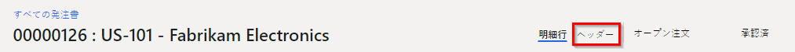
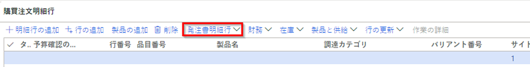

---
lab:
  title: 'ラボ 2:発注書の作成'
  module: 'Module 3: Learn the Fundamentals of Microsoft Dynamics 365 Supply Chain Management'
---

# モジュール 3:Microsoft Dynamics 365 Supply Chain Management の基礎を学ぶ

## ラボ 2 - 発注書の作成

## 目標

It's more typical for purchase orders to be created automatically as result of master planning, direct delivery, and other processes. When created manually, a purchase order is usually created by a purchasing agent. Create a purchase order using the the USMF company.

## ラボのセットアップ

   - **推定時間**:10 分

## Instructions

1. Finance and Operations の [ホーム] ページの右上で、USMF 社の作業を行っていることを確認します。

1. 必要な場合、会社を選び、メニューから **USMF** を選択します。

1. 左上で、**[ナビゲーション ペインの展開]** ハンバーガー メニューを選択します。

1. **[モジュール]**、**[調達]**、**[発注書]**、**[すべての発注書]** の順に選択します。

1. すべての発注書ページの上部メニューで、**[+ 新規]** を選択します。

1. [発注書の作成] ペインで、**[仕入先勘定]** メニューを選択し、**[US-101]** を選択します。

1. When you select a vendor, details from the vendor record, such as address, invoice account, delivery terms, and delivery mode, will be copied as default values into the order header. You can change these values at any time.

1. **[全般]** セクションを展開します。

1. **[保管分析コード]** から **[サイト]** メニューを選択し、サイトの一覧を確認します。

1. The Site field, together with the Warehouse field, specifies where the procured goods or services must be delivered. The default delivery address is the site. Both fields can be populated with values set up for the selected vendor, or you can specify them manually.

1. **[日付]** から、"出荷日" フィールドを使用して、調達された商品やサービスを配送する日付を指定します。

1. You can specify a single delivery date for the order, or the individual order lines can be given unique delivery dates. If the delivery date specified here cannot be met for specific products or services because they have longer lead times, then those lines will be created with a later delivery date to accommodate for this.

1. Expand the <bpt id="p1">**</bpt>Administration<ept id="p1">**</ept> section. The <bpt id="p1">**</bpt>Orderer<ept id="p1">**</ept> box can be used to specify who is placing the order.

1. 発注書がマスター プラン、直納,、その他のプロセスの結果として自動生成されるほうが通例です。

1. **[OK]** を選択します。

1. 発注書は手動作成の場合通常歯購買担当者が行います。

    

1. **[発注書明細行]** の下のメニューで、**[発注書明細行]** を選択します。

    

1. **[ディスプレイ]** の下の **[分析コード]** を選択します。

1. USMF 会社を使用して発注書を作成します。

1. **[製品分析コード]** の [分析コード表示] ペインで、**[色]** チェック ボックスをオンにします。

1. 省略可能:設定の保存 トグル スイッチを選択すると、選択した分析コードが、次に発注書ページを開いた時に注文ライン グリッドにも表示されます。

1. **[OK]** を選択します。

1. **[品目番号]** セル メニューを選択し、**[T0004]** を選択します。

1. リスト内をスクロールせずに、フィルター ボックスに入力することもできます。

1. 製品およびサービスの注文明細行は、調達カテゴリを指定して品目番号または経費として指定することで作成されます。

1. Procurement category is used for adding lines where procured items are expensed directly, rather than going into inventory. This means that if you need to expense a purchase, you can do this by creating a purchase order line that specifies a procurement category, rather than creating a line with an item number. Items can also be associated with a procurement category and in this case, the procurement category is shown as informational only.

1. **[色]** メニューを選択、使用できるオプションを確認し、色または色の組み合わせを 1 つ選択します。

1. 通常、サイトと倉庫には注文ヘッダーの値が入力されますが、一部の明細行を別の場所に配送する必要がある場合は、フィールドを上書きすることができます。

1. **[数量]** ボックスに、「**10**」と入力します。

1. 製品が設定されている場合、または値が 1 の場合、製品の最小注文数量が自動的に入力されます。

1. 追加情報:

    - <bpt id="p1">**</bpt>Unit<ept id="p1">**</ept>: Indicates the unit of measure for the ordered quantity. Normally, the unit is automatically provided from the purchasing unit on the product master data.

    - <bpt id="p1">**</bpt>Unit price<ept id="p1">**</ept>: Contains a value from either a purchase agreement or a trade agreement. It is possible to change the unit price on individual order lines—for example, if a unique price is negotiated with the vendor.

    - <bpt id="p1">**</bpt>Discount<ept id="p1">**</ept>: Represents a discount amount per unit. This discount therefore reduces the unit price by the discount. This discount is commonly supplied automatically from purchase agreements or trade agreements, but it is possible to override on individual lines if unique discounts have been negotiated with the vendor.

    - <bpt id="p1">**</bpt>Discount percentage<ept id="p1">**</ept>: When entered, this reduces the net amount for the line accordingly. The discount percent is often supplied automatically from purchase agreements or trade agreements, but it is possible to override on individual lines if a unique discount percentage has been negotiated with the vendor.

    - <bpt id="p1">**</bpt>Net amount<ept id="p1">**</ept>: Calculated from other fields on the line, including quantity, unit price, discount, and discount percent. It is possible to change the Net amount, but then the Unit Price, Discount, and Discount percent fields will be blank, and when you post toward the line, the amount posted will be proportional to the net amount. Generally, the Net Amount field is only used for displaying the net amount of the line.

1. ページの下部にある発注書明細行で、**[明細行の詳細]** を選択します。

1. **[配送]** タブを選択します。

1. A unique delivery date can be assigned to each order line. The date is inherited from the field on the purchase order header, but you can change this.

1. [発注書明細行] ページを閉じます。

1. すべての発注書ページで、フィルター機能を使用して新しい発注書を検索します。

1. 完了したら、[すべての発注書] ページを閉じて、[ホーム] ページに戻ります。
